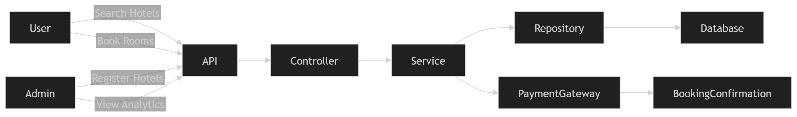
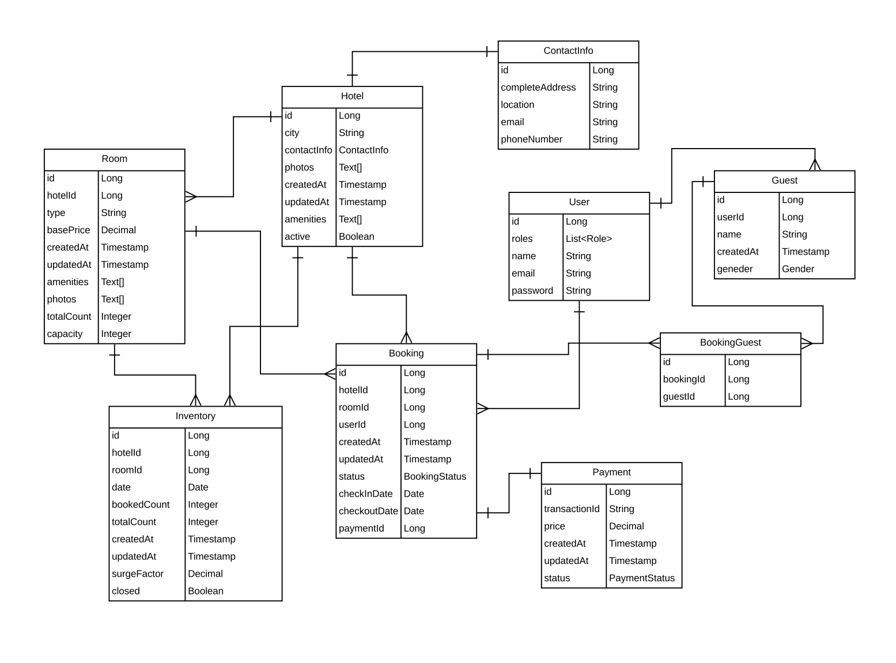
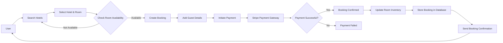

# Journey Mate 

Welcome to Journey Mate! This is a web-based application designed to help travelers easily discover, compare, and pre-book accommodations across different locations. The platform enables users to search hotels in various regions, explore available facilities, compare pricing, and reserve rooms before their visit.

By integrating a secure payment system, a dependable booking system, and an effective search system, the application aims to provide a seamless accommodation discovery experience. By providing comprehensive hotel information, Journey Mate streamlines the process of locating appropriate lodging and empowers users to make well-informed booking choices.
## Key Features 

Accommodation Search

The platform allows users to search for hotels across different locations. Users can quickly find accommodations based on region, availability, and pricing options.

Hotel Comparison

Users can view and compare multiple hotels in the same region. The system displays important information such as available facilities, pricing, and room options to help users select the most suitable accommodation.

Detailed Hotel Information

Each hotel listing provides comprehensive details including amenities, room types, pricing information, and availability status. This enables users to evaluate hotels before making reservations.

Pre-Booking Functionality

Journey Mate allows users to reserve accommodations in advance for planned travel dates. The booking system ensures that availability is checked before confirming a reservation.

User Account Management

Registered users can manage their profiles, track previous bookings, and view their reservation history.

Booking Management

Users can review booking details, manage upcoming reservations, and access information related to their travel accommodations.
## Tech Stack

**Server:** Java, Spring Boot, REST API, Hibernate/JPA

**Database:** PostgreSQL, Relational Database

**Developer Tools:** 
    Git, 
    GitHub,
    Maven, 
    Postman for API testing

## badges
# Journey Mate – Hotel Management System


## Project Structure

project Mate /
```text
HotelAdministration/
│
├── JourneyMate/
│   ├── pom.xml
│   ├── mvnw
│   ├── mvnw.cmd
│   │
│   ├── docs/
│   │   └── diagrams/
│   │       ├── DFD.png
│   │       └── er-diagram.png
│   │
│   └── src/
│       └── main/
│           ├── java/com/projects/JourneyMate/
│           │
│           │   ├── controller/
│           │   ├── service/
│           │   ├── repository/
│           │   ├── entity/
│           │   ├── dto/
│           │   ├── config/
│           │   ├── security/
│           │   ├── strategy/
│           │   ├── advice/
│           │   └── util/
│           │
│           └── resources/
│               ├── application.properties
│               └── static/
│
└── .idea/
```

## System Architecture

Journey Mate follows a modular backend architecture that separates different functional components of the application. This approach improves maintainability, scalability, and performance.

Key architectural components include:

RESTful API layer for communication between client and server

Service layer responsible for business logic

Database layer for managing hotel and booking data

Payment integration module for handling transactions

This layered architecture ensures that each component remains independent and easy to extend in future versions.


## Dataflow Diagram



This diagram illustrates the interaction between users, administrators, booking services, and payment processing within the Journey Mate system.

## 🗄 Database Entity Relationship Diagram

## ER-diagram 



The Entity Relationship (ER) diagram represents the database structure of the Hotel Management Application and illustrates how different entities interact within the system to support hotel booking, inventory management, and payment processing.

The system is centered around the User, Hotel, Room, Booking, and Payment entities, which together manage the end-to-end accommodation booking workflow.

## Booking workflow


## Installation

Clone the project from github 
```bash
git clone https://github.com/nayudusai/Journey-Mate.git
```

Navigate to project directory 

```bash 
cd Journeymate
```

## Build the application in the local IDE

```bash
mvn clean Installation
```

## Run the application 

```bash 
mvn spring-boot:run
```

## Application runs on:
```bash
http://localhost:8080
```
## Configurations

Before running the Journey Mate application locally, ensure that the required configurations for the database, application properties, and external integrations are correctly set.

### Database configuration
``` bash 
spring.datasource.url=jdbc:postgresql://localhost:5432/journey_mate
spring.datasource.username=DATABASE_USERNAME
spring.datasource.password=DATABASE_PASSWORD
spring.datasource.driver-class-name=org.postgresql.Driver
```

### Server configuration

``` bash
server.port=8080
```

### Payment gateway configuration 
```bash
stripe.secret.key=your_stripe_secret_key
stripe.webhook.secret=your_webhook_secret
```

##### Note:
For security reasons, it is recommended to use environment variables instead of hardcoding credentials.

## API Documentation

## 📚 API Documentation (Swagger)

Journey Mate provides interactive API documentation using **Swagger UI**.

Once the application is running locally, the API documentation can be accessed at:

| Tool | URL |
|-----|-----|
| Swagger UI | http://localhost:8080/swagger-ui/index.html |
| OpenAPI JSON | http://localhost:8080/v3/api-docs |
